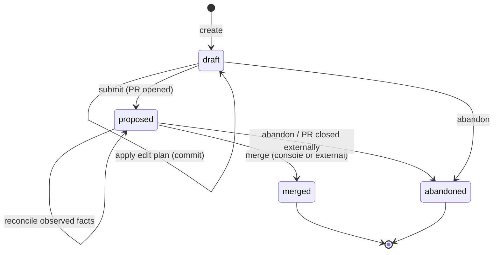
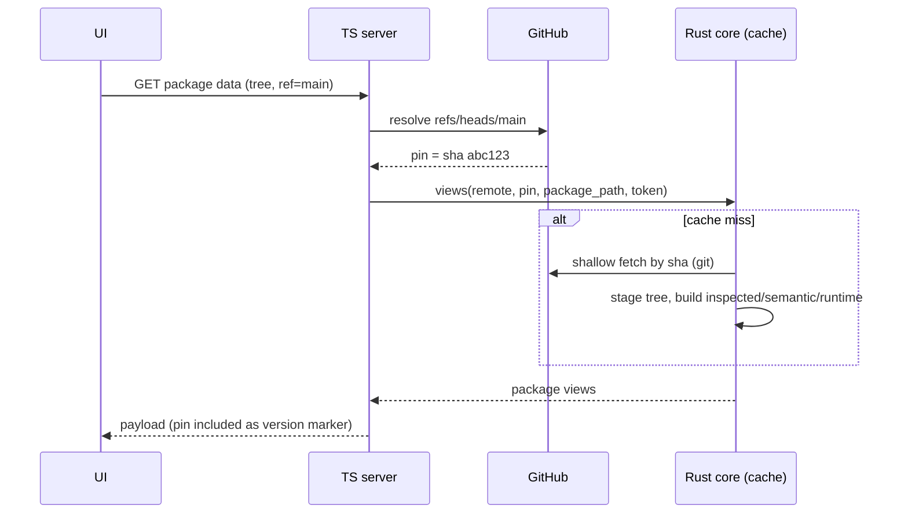
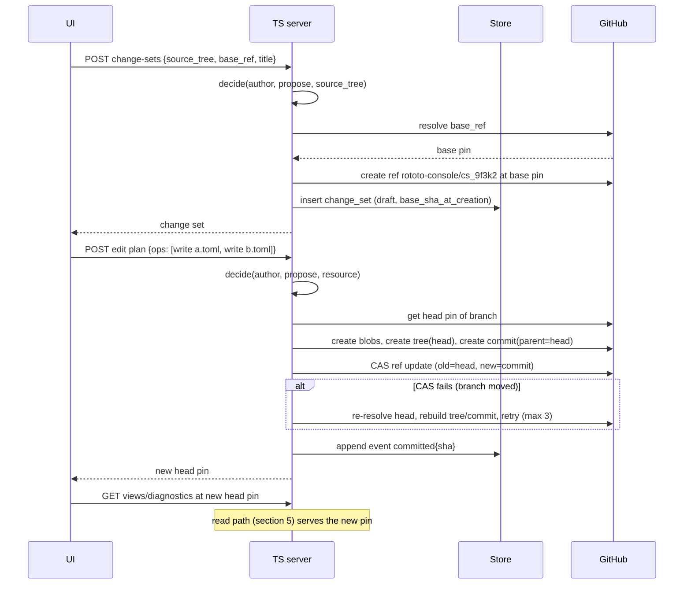
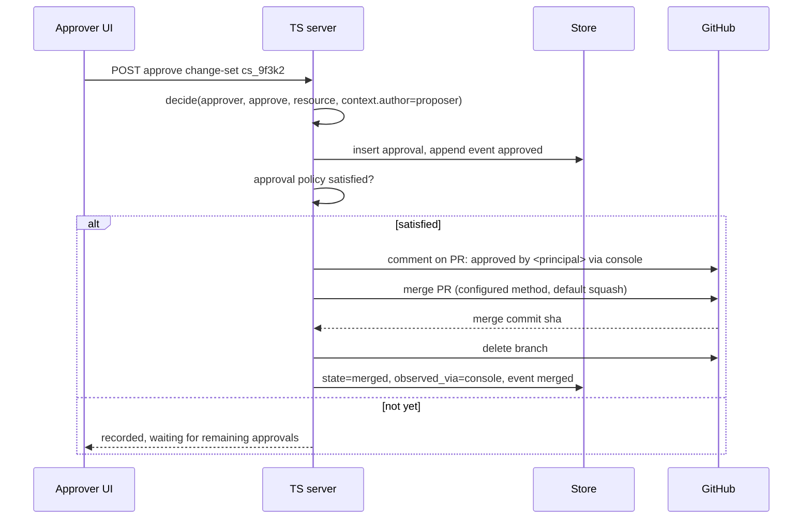
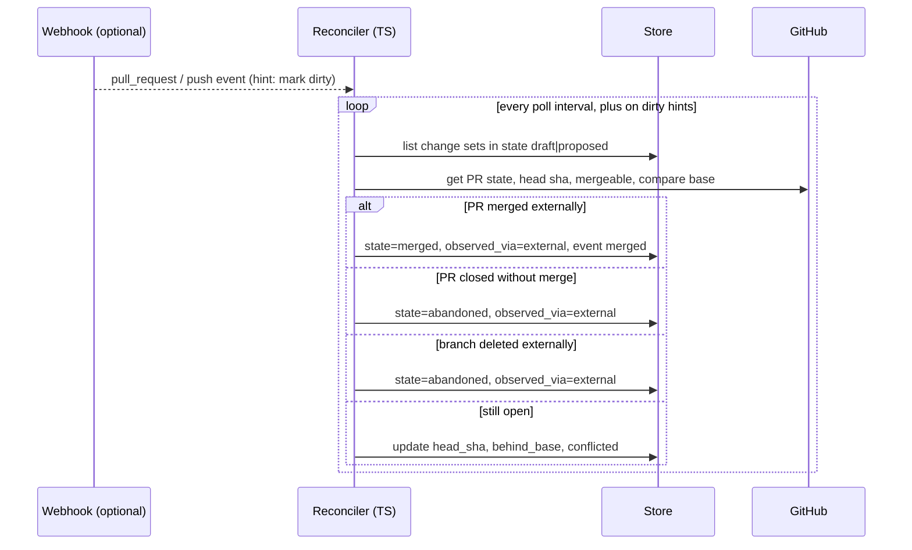

# Console git ops (Layer 2)

Status: draft for review. This is the Layer 2 spec for the console
re-implementation: how configuration changes move through git. It builds on
the Layer 1 spec (`design/console-identity-authz.md`), which defines
principals, `decide()`, and the advisory/authoritative split. Layer 2 is
content-agnostic on purpose: it moves files and refs and knows nothing about
variables or catalogs. Higher layers hand it edit plans; it hands them back
staged package views.

The console server is TypeScript (Layer 1, section 12); git writes go
through octokit, and read staging lives in the Rust core behind bindings.

## 1. Scope

In scope: repository registration and package discovery, read staging and
caching, change sets (branches, commits, pull requests, merge), credential
selection, state reconciliation with GitHub, and webhooks as an accelerant.

Non-goals, kept deliberately out so the layer stays small:

- No generic git write backend. Writes are GitHub API only, as today.
- No clone-and-push write path, no commit signing keys, no local merge or
  rebase computation. GitHub computes mergeability; the console surfaces
  conflicts, it never resolves them.
- No multi-VCS abstraction.
- No correctness dependency on webhooks.

## 2. Invariants

Every mechanism in this spec is a consequence of one of six invariants. When
a future change seems to need violating one, that is the signal to stop and
reopen the design, because these are what keep the system reasonable.

1. **Git holds content; the store holds coordination.** No file content, no
   draft edits, no pending overlays ever live in the console store. Litmus
   test: deleting the store loses only bookkeeping, all of it rediscoverable
   from GitHub (section 4.4 shows the rebuild path).
2. **Cache by value, resolve pointers cheaply.** Symbolic refs (branch
   names) are resolved to commit SHAs at the boundary; everything below the
   boundary is keyed by SHA and therefore immutable. There is no cache
   invalidation, only re-resolution of pointers.
3. **One logical change is one commit.** Edit plans apply atomically through
   the git data API (blobs, one tree, one commit, compare-and-swap ref
   update). The branch never holds a state nobody proposed.
4. **Desired versus observed state.** Change-set rows record intent; GitHub
   is observed truth; a reconciler converges them. Webhooks only make
   reconciliation prompt, never correct.
5. **Authority follows the credential.** A user token means GitHub enforces
   and the console predicts. The app token means GitHub sees only the app
   and the console must enforce `decide()` before every call. Same
   endpoints, opposite trust posture.
6. **Git wins on drift.** The console is a view over git. Changes made
   outside the console are noticed and rendered, never fought.

## 3. Concepts

- **Source tree**: a registered GitHub repository (or a local folder in
  local mode). Deployment-level in hosted mode per Layer 1.
- **Revision**: a symbolic ref (branch). **Pin**: a resolved commit SHA.
  The TypeScript server resolves revisions to pins; the Rust core only ever
  sees pins.
- **Change set**: the unit of proposal. One change set = one branch = at
  most one pull request. Scoped to one source tree; the packages it touches
  are derived from its diff, not declared.
- **Edit plan**: an ordered list of file operations (`write path content`,
  `delete path`) handed down from Layer 3 or 4. Layer 2 treats it as opaque
  file ops.
- **Acting credential**: the user's linked GitHub token or the console's
  GitHub App installation token, selected per section 7.
- **Reconciler**: the background loop converging change-set rows with
  observed GitHub state.

## 4. Data model

### 4.1 Git side (the real state)

- **Branch**: `rototo-console/<change-set-id>` where the id is a short
  generated slug (`cs_9f3k2`). No login or title in the branch name;
  attribution lives in commits and display names live in the store.
- **Commit**: one per applied edit plan, created via the git data API.
  Message: one summary line from the layer above, then trailers. When the
  app acts: `Acting-For: <principal-id> (<display name>)`. App commits get
  GitHub's verified signature automatically.
- **Pull request**: one per change set, opened at submit. The body carries
  a human-readable summary and one machine marker line,
  `Rototo-Change-Set: <id>`, which makes store rebuild possible.
- **Merge**: GitHub merge API. Method is deployment configuration,
  default `squash`; the squash message preserves the summary and trailers.
  The branch is deleted after merge or abandonment.

### 4.2 Store (coordination only, SQLite)

```text
source_trees        id, kind (github|local), owner, name, default_branch,
                    created_by FK, created_at, last_discovered_at

discovered_packages source_tree_id FK, path, discovered_at, active
                    -- rebuildable cache of rototo-package.toml roots

change_sets         id (slug), source_tree_id FK, title,
                    author_principal FK, acting_mode (user|app),
                    base_ref, base_sha_at_creation,
                    state (draft|proposed|merged|abandoned),
                    -- observed facts, written only by the reconciler:
                    pr_number NULL, pr_url NULL, head_sha NULL,
                    behind_base BOOL, conflicted BOOL,
                    observed_via (console|external) NULL,
                    last_reconciled_at, created_at, updated_at

change_set_approvals change_set_id FK, principal_id FK, approved_at

change_set_events   id, change_set_id FK, at, actor FK NULL,
                    event (created|committed|submitted|approved|merged|
                           abandoned|updated_from_base|conflict_seen|...),
                    detail (JSON: commit sha, pr number, ...)
                    -- append-only; Layer 2's audit trail
```

Notes:

- `state` is intent plus terminal observation. `behind_base`,
  `conflicted`, and `observed_via` are observed facts and may change on
  every reconcile; `state` changes only through the machine in 4.5.
- There is no table holding file content or edit plans. Applied plans exist
  only as commits. This is invariant 1 and it is load-bearing: it is why
  conflict resolution, rebuild, and audit all reduce to git questions.

### 4.3 Cache (Rust core, in-memory plus tempdirs, rebuildable)

- Staged trees keyed by `(remote, pin)`. Fetch is shallow by SHA
  (`git fetch --depth=1 origin <sha>`; GitHub supports SHA fetches), into a
  tempdir owned by the cache entry.
- Package views keyed by `(pin, package_path)`, holding the three derived
  views (inspected, semantic, runtime), built lazily, single-flight.
- Entries are immutable, so eviction is size-based LRU, never
  correctness-based. No invalidate-on-write exists anywhere.

### 4.4 The rebuild path (litmus test for invariant 1)

Rebuilding a lost store: re-register source trees; list branches matching
`rototo-console/*`; for each, find its PR by branch name and read the
`Rototo-Change-Set` marker; reconstruct `change_sets` rows in state
`proposed` (open PR), `merged`, or `abandoned` (closed PR); branches with no
PR become `draft`. Approval records and event history are the one true loss,
which is why approvals also appear in the PR timeline as comments when the
app merges (section 6.3).

### 4.5 Change-set state machine



Only four states. "Behind base", "conflicted", and "approved but waiting"
are observed facts or derived answers, not states; folding them into the
machine is how change-lifecycle systems usually rot.

## 5. Read path

The one rule: **resolve, then stage by pin.** The TypeScript server resolves
a revision to a pin with one GitHub call and passes the pin across the
binding. The Rust core never sees a branch name, which is what keeps its
cache free of invalidation.



Freshness of the pointer itself: ref resolutions are cached for a short TTL
(seconds to a minute) and marked dirty by push webhooks when configured.
A stale pointer costs seeing slightly old content; it can never cause a
wrong cache entry (invariant 2).

Semantic diffs (change review, `rototo diff` in the console) are computed by
the Rust core from two staged pins. Changed-file lists come from GitHub's
compare API. Neither requires the un-shallow/fetch diff machinery the
current console carries; it is retired.

## 6. Write path

### 6.1 Create a change set and apply an edit plan



The CAS retry re-applies the *plan* onto the new head, it does not merge
content. If the same file was changed by both writers, the retry's tree
still overwrites within the plan's paths; that is correct because a branch
belongs to one change set and concurrent writers on it are two windows of
the same proposal, not two proposals.

### 6.2 Submit

Submit opens the PR and moves state to `proposed`. The PR body carries the
summary from the layer above, the `Rototo-Change-Set` marker, and (when the
app acts) the acting principal.

### 6.3 Approve and merge (app credential, authoritative)



The PR comment is deliberate redundancy: approvals then survive a store
loss inside the PR timeline (section 4.4), and GitHub-side observers see
who approved without console access.

On the developer fast path (user token, advisory), the console does not
gate the merge: the user merges in the console or on GitHub, their token
performs it, and GitHub's branch protection is the enforcement. The
sequence is the same minus the policy gate, and `decide()` was already
consulted only to render honest buttons (Layer 1, Backend A).

### 6.4 Base moved: update and conflict

When the reconciler observes `behind_base`, the console offers "update from
base", which calls GitHub's update-branch API (merges base into the branch
server-side). If GitHub reports the branch unmergeable, `conflicted` is set
and the resolution is human: the change set opens in the workbench (Layer 3)
for manual edits, which are just further commits on the branch. Layer 2
never computes merges (non-goal), so this whole path is two API calls and
one observed flag.

## 7. Credential selection and attribution

One function, evaluated per operation:

```text
acting_credential(principal, source_tree):
    if principal has linked GitHub identity
       and that identity has write permission on the repo:
        -> user token   (advisory mode: GitHub enforces)
    else if the deployment has an App installation on the repo:
        -> app token    (authoritative mode: decide() enforces, approvals apply)
    else:
        -> no write capability (read-only rendering)
```

- App installation tokens are minted from the App JWT per installation,
  cached in memory until expiry, never stored at rest.
- Every app-authored commit and PR carries `Acting-For`; user-token
  operations self-attribute through GitHub.
- The mode is recorded on the change set (`acting_mode`) at creation and
  re-derived per operation; a principal linking a GitHub identity mid-flight
  simply starts getting user-token operations, which is harmless because
  both paths write the same shapes.

## 8. Reconciliation

One loop, one job: make rows match GitHub.



- Poll interval: minutes at rest; dirty hints collapse it to seconds. All
  transitions are idempotent, so a duplicated or late webhook is harmless.
- The reconciler is the only writer of observed columns, which keeps write
  ownership of every column single (request handlers write intent, the
  reconciler writes observation).
- Webhook deliveries are verified (HMAC) and then reduced to "mark dirty";
  no webhook payload is ever trusted as state (invariant 4).

## 9. Local mode

Local folder sources keep today's model, unchanged: direct writes to the
working tree, no change sets, no PR machinery, read-only git introspection
for diffs, path/symlink hardening as-is. The working tree is both truth and
draft. Change sets require a GitHub source tree; the UI simply does not
offer proposal flows for local sources. Local mode is how a developer edits
their checkout with the console as a fancy editor; the proposal machinery
is what hosted deployments buy.

## 10. TypeScript / Rust boundary

| Concern | Owner |
| --- | --- |
| Ref resolution, all GitHub REST (octokit), webhooks, credential selection, App tokens | TypeScript |
| Change-set store, state machine, reconciler, approvals, events | TypeScript |
| Staging by `(remote, pin)`, package discovery in a staged tree, views (inspected/semantic/runtime), semantic diff between two pins, lint | Rust core via bindings |

The contract across the boundary is the pin rule: TypeScript always passes
resolved SHAs; the Rust core never resolves a moving ref for the console.
Layer 2's bindings inventory (per the Layer 1 section 12 convention):
`stage(remote, pin, auth) -> tree handle`, `discover(tree) -> package
paths`, `views(tree, package_path)`, `diff(tree_a, tree_b, package_path)`,
plus lint over a staged view. Nothing else.

## 11. Failure handling

- **CAS conflict**: bounded retry (3), then a clear error carrying both
  pins. Never force-push.
- **Rate limits**: octokit throttling with conditional requests. App
  installations get their own budget, separate from user tokens.
- **Partial git-data writes**: orphaned blobs/trees from a failed sequence
  are unreferenced objects GitHub garbage-collects; no cleanup needed.
- **GitHub outage**: reads keep serving cached pins; ref resolution and all
  writes fail with explicit errors. Nothing queues; the console does not
  pretend to be offline-first.
- **Reconciler crash**: harmless by design; the next pass re-derives
  everything from GitHub.

## 12. What this retires from the current implementation

- Contents-API per-file commits and per-file blob-SHA optimistic checks
  (superseded by git-data commits and CAS ref updates).
- Symbolic-ref cache keys and the invalidate-after-every-write dance.
- The un-shallow-and-fetch branch diff machinery in `stage/branch_changes.rs`
  (superseded by compare API plus two-pin semantic diff).
- Per-request `sync-pr` freshness checks (superseded by the reconciler).
- Branch rename support (change-set titles are store data; branch names are
  opaque ids).
- Per-principal source trees in hosted mode (already retired by Layer 1).

The git subprocess hardening (env scrubbing, ref validation, timeouts,
symlink refusal) is kept wholesale in the Rust staging path.

## 13. Phasing

Aligned with Layer 1's phases:

- **With Layer 1 Phase A**: pin-based staging and cache, git-data-API
  commits with CAS, change sets and the state machine, reconciler,
  user-token operations only (advisory). Deliverable: today's UX on the new
  substrate, minus the retired machinery.
- **With Layer 1 Phase B**: App credential (JWT, installation tokens),
  authoritative gating, console approvals with PR comments, console-
  initiated merge, webhooks as dirty hints.

## 14. Revisit triggers

- **Clone-and-push school**: only if the console ever needs to compute
  merges or rebases locally. No known driver.
- **Persistent bare mirrors**: only if shallow-fetch-by-SHA costs or rate
  limits hurt in practice; the SHA-keyed cache design is unchanged by that
  swap, which is the point of invariant 2.
- **Multi-VCS**: out until the product reopens it.
- **Edit-plan replay for conflict resolution**: if manual conflict
  resolution in the workbench proves too raw for business users, consider
  storing the last edit plan per change set to offer "recreate on new
  base". This would be the first content-adjacent thing in the store, so it
  must clear invariant 1 review first.
