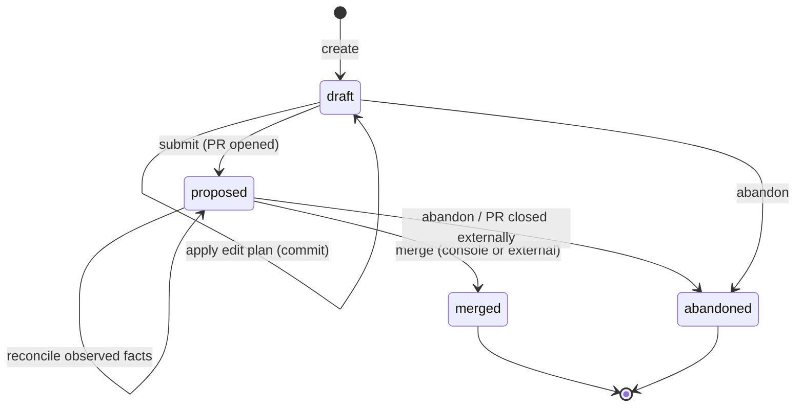
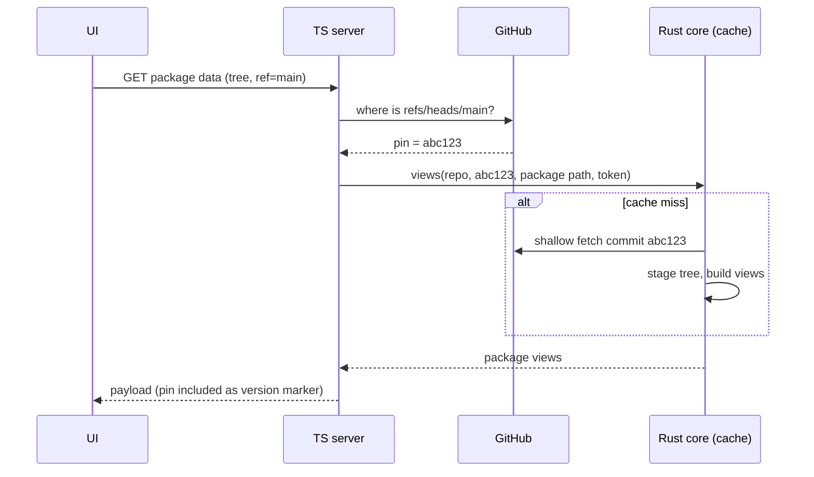
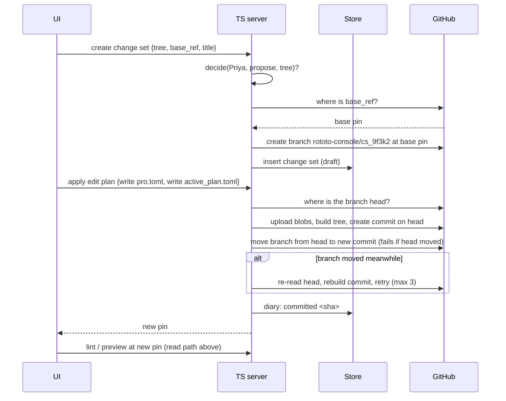
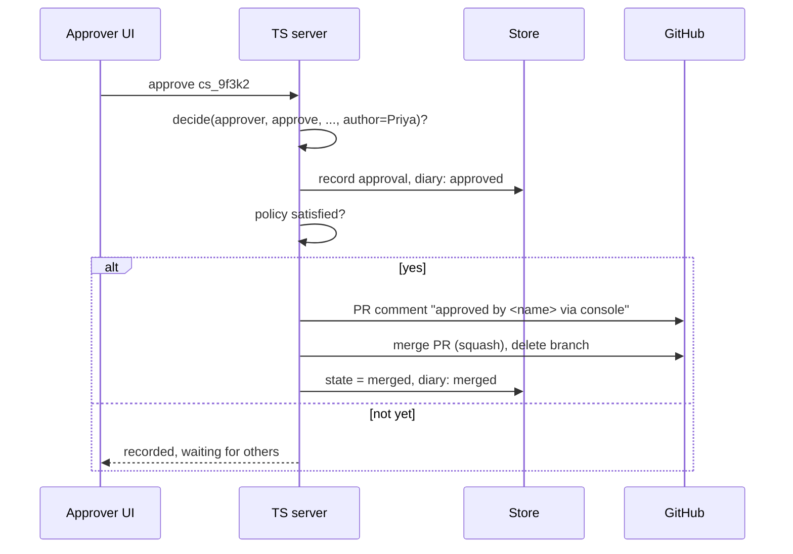
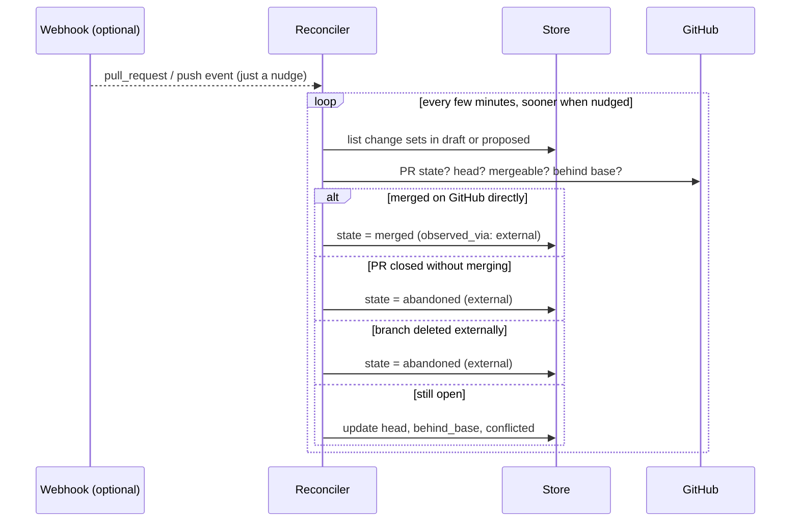

# Console git ops (Layer 2)

Status: draft for review. This layer builds on the identity and authorization
spec (`design/console-identity-authz.md`). The console server is TypeScript
(see that spec, section 12); git writes go through octokit, and package
reading lives in the Rust core behind bindings.

## What this layer does

The console lets people change configuration. Every one of those changes has
to end up as a git commit, because git is where rototo config lives and where
review happens. This layer is the machinery that makes that true.

It moves files and refs, and that is all it does. It does not know what a
variable or a catalog is. A higher layer hands it an instruction like "on
this branch, write these two files and delete that one", and this layer turns
that into branches, commits, and pull requests, then keeps track of where
each change stands.

To keep it small, we are deliberately not building four things:

- Writes go through the GitHub API only. No general "any git server" backend.
- No cloning repos to push from the server. We never hold a working copy for
  writing, so there are no signing keys to manage and no clone state to babysit.
- The console never resolves merge conflicts. GitHub tells us a branch
  conflicts; a human fixes it. We refuse to be a merge engine.
- Webhooks are a nice-to-have. Nothing is wrong if they never arrive.

## The six rules

The whole design hangs off six rules. Each mechanism below is just one of
these rules playing out. If some future change seems to need breaking one,
that is the moment to stop and reopen the design, because these rules are
what keep the system easy to reason about.

**Rule 1: git keeps the content, the database keeps the bookkeeping.** The
console database never holds file contents, draft edits, or anything you
would cry about losing. It holds things like "this branch belongs to that
person" and "this change is waiting for approval". The test we hold
ourselves to: if the database were deleted, we could rebuild it by looking
at GitHub (there is a fire drill section below that walks through exactly
that). Why so strict? Because the moment two places both claim to hold the
truth, you spend the rest of the project writing code to reconcile them.

**Rule 2: cache by commit, not by branch.** A branch name is a pointer that
moves. A commit SHA never changes, and neither does anything derived from
it. So the read cache is keyed by commit, where entries can never go stale,
and the only freshness question left is the tiny one: "which commit is this
branch pointing at right now?" That question is one cheap API call. The
current console caches by branch name and pays for it with invalidation
logic everywhere; this design has no cache invalidation at all.

**Rule 3: one edit, one commit.** When someone's change touches three files,
those three files land in a single commit, not three. Two reasons. A
reviewer approves a state of the world, and with per-file commits the branch
passes through in-between states nobody proposed (schema exists, entry
missing). And GitHub lets us say "move the branch from A to B" in a way that
fails if the branch is no longer at A, so a whole multi-file edit either
lands cleanly or not at all. One logical change, one commit, like a database
transaction.

**Rule 4: write down what we want, watch what actually happens.** A change
set row records intent: "this should become a PR and get merged". GitHub is
what actually happened. A small background job (the reconciler) compares the
two and updates our rows. Webhooks exist only to make it look sooner; if
every webhook were lost, everything would still be correct, just a little
slower. Tools that trusted webhooks as truth have all been burned; events
get lost, arrive twice, or arrive out of order.

**Rule 5: whoever's token does the write decides who enforces.** When a
developer's own GitHub token makes the commit, GitHub checks their
permissions, so the console only needs to predict (grey out buttons, be
honest in the UI). When the console's GitHub App token acts for someone who
has no GitHub account, GitHub would allow almost anything, so the console
must check permissions itself before every call. Same API, opposite trust
posture. This rule connects Layer 2 to Layer 1's `decide()`.

**Rule 6: if the repo changes outside the console, the repo is right.**
Someone edits a TOML file in vim and pushes. Fine. The console notices and
re-renders. It never argues, never overwrites, never tries to win.

## Five words

- A **change set** is one person's proposed change: one branch, at most one
  pull request. "Priya's price update" is a change set.
- A **pin** is a commit SHA. A **revision** is a branch name. We resolve
  revisions into pins early and pass pins around everywhere after that.
- An **edit plan** is the instruction handed down from higher layers: an
  ordered list of "write this file with this content" and "delete that
  file". This layer treats the contents as opaque bytes.
- The **acting credential** is whichever token performs a write: the user's
  own GitHub token, or the console's App token acting on their behalf.
- The **reconciler** is the background job from Rule 4.

## What lives where

### In git (the real state)

- The branch is named `rototo-console/<change-set-id>`, something like
  `rototo-console/cs_9f3k2`. No usernames or titles in branch names; those
  are display data and live in the database.
- Each applied edit plan is one commit. The message is a summary line from
  the layer above, plus a trailer when the App acts:
  `Acting-For: <principal-id> (<display name>)`. Commits made through the
  API by the App come out with GitHub's "verified" badge automatically.
- The pull request body carries a human summary plus one machine-readable
  line: `Rototo-Change-Set: cs_9f3k2`. That line is what makes the fire
  drill below possible.
- Merging uses GitHub's merge API. The method is deployment config,
  defaulting to squash, and the squash message keeps the summary and
  trailers. The branch is deleted after merge or abandonment.

### In the database (bookkeeping only)

```text
source_trees        id, kind (github|local), owner, name, default_branch,
                    created_by, created_at, last_discovered_at

discovered_packages source_tree_id, path, discovered_at, active

change_sets         id (slug), source_tree_id, title,
                    author_principal, acting_mode (user|app),
                    base_ref, base_sha_at_creation,
                    state (draft|proposed|merged|abandoned),
                    -- observed facts, written only by the reconciler:
                    pr_number, pr_url, head_sha,
                    behind_base, conflicted, observed_via,
                    last_reconciled_at, created_at, updated_at

change_set_approvals change_set_id, principal_id, approved_at

change_set_events   change_set_id, at, actor,
                    event (created|committed|submitted|approved|merged|...),
                    detail (commit sha, pr number, ...)
```

Reading it plainly: `source_trees` is the list of registered repos.
`discovered_packages` is a rebuildable note of where the
`rototo-package.toml` files are. `change_sets` is one row per proposed
change. `change_set_approvals` records who approved what.
`change_set_events` is an append-only diary, and it is Layer 2's audit
trail.

One discipline worth calling out: every column has exactly one writer.
Request handlers write the intent columns; the reconciler writes the
observed ones (`pr_number` through `observed_via`). Nobody fights over a
column, which removes a whole class of races.

And one absence worth calling out: there is no table of file contents or
edit plans. An applied plan exists only as its commit. That is Rule 1, and
it is load-bearing: it is why rebuild, audit, and conflict handling all
reduce to git questions.

### In the cache (Rust core, rebuildable)

When the console needs to actually read a package (lint it, render it,
preview a resolution), the Rust core stages a copy: a shallow fetch of one
commit into a temp directory (GitHub supports fetching by SHA), then the
derived views (inspected, semantic model, runtime) built lazily on top.
Everything is keyed by `(repo, pin)`, built once even under concurrent
requests, and evicted only when the cache gets too big. Never for
correctness, because pinned content cannot go stale (Rule 2).

### The fire drill (proving Rule 1)

Say the console database is gone. Re-register the source trees. List
branches starting with `rototo-console/`. For each, find its PR and read
the `Rototo-Change-Set` line: open PR means state `proposed`, merged PR
means `merged`, closed PR means `abandoned`, no PR means `draft`. That
rebuilds the change-set table. The genuine loss is the approvals and event
diary, which is why the console also leaves an approval comment on the PR
itself when it merges (you will see this in the approval flow below): the
PR timeline keeps a copy of the part we cannot rebuild.

## The life of a change set



Four states, and it will stay four. Things like "behind base", "has a
conflict", or "waiting on one more approval" are deliberately not states.
They are facts the reconciler observes, or answers computed when asked.
Folding facts into the state machine is how these systems usually rot: you
end up with `proposed_but_behind_and_half_approved` and nobody can reason
about transitions anymore.

## Reading a package

The rule in one line: resolve the branch to a pin first, then everything
below works on the pin.



The Rust core never sees a branch name. That single handoff rule is what
keeps its cache free of invalidation logic.

"Where is main pointing?" answers are themselves cached for a few seconds
to a minute, and a push webhook clears them early when configured. Worst
case with no webhooks: you see slightly old content for a few seconds. You
can never see wrong content, because wrong would require a pin to change,
and pins do not change.

Diffs come from the same machinery: the changed-file list from GitHub's
compare API, and the semantic diff (what changed in rototo terms) computed
by the Rust core from two staged pins. The current console's
un-shallow-and-fetch diff gymnastics disappear.

## Making a change

Meet Priya. She manages pricing, has no GitHub account, and wants to bump
the pro plan's monthly price. A higher layer turns her form edit into an
edit plan touching two files. Here is what this layer does with it:



Two things deserve plain words.

The "fails if head moved" part: when we ask GitHub to move the branch, we
tell it what we think the current head is. If someone else committed in
between, GitHub refuses, we re-read the head, rebuild the commit on top of
it, and try again, three times at most. This is the same optimistic
trick databases call compare-and-swap, and it is what makes a multi-file
edit land atomically or not at all (Rule 3).

And the retry re-applies Priya's plan; it does not try to merge content.
That is fine because a branch belongs to exactly one change set. If two
writers race on it, that is Priya with two tabs open, not two different
proposals fighting.

## Getting it approved and merged

Priya submits. The console opens a PR (state becomes `proposed`). Since the
App token acts for her, the console is the enforcement point (Rule 5): her
change waits for whatever approval the policy demands.



The PR comment is deliberate redundancy: it puts the approval into the PR
timeline, where the fire drill can find it and where GitHub-side reviewers
can see who approved without console access.

Developers on the fast path skip all of this. Their own token made the
commits, so GitHub's branch protection is the enforcement: they merge in
the console or on GitHub, whichever they like, and the console just renders
honestly what is allowed (Layer 1, Backend A).

## When the world changes under you

The reconciler is a loop with one job: make our rows match GitHub.



Everything here is idempotent: seeing the same fact twice does nothing, so
duplicate or late webhooks are harmless. Webhook payloads are verified and
then reduced to "check this one sooner"; we never copy state out of a
webhook body (Rule 4).

Two observed facts get UI affordances:

- **Behind base**: main moved since the change set branched. The console
  offers "update from base", which is one GitHub API call (it merges base
  into the branch server-side). No local git.
- **Conflicted**: GitHub says the branch cannot merge cleanly. A human
  resolves it by editing in the workbench (Layer 3), which is just more
  commits on the branch. The console never merges content itself.

## Whose token does the work

Per operation, one selection rule:

```text
if the person has a linked GitHub identity with write access to the repo:
    use their token          (GitHub enforces; console predicts)
else if the App is installed on the repo:
    use the App token        (console enforces via decide(); approvals apply)
else:
    read-only
```

App tokens are minted from the App's key per installation, live about an
hour, stay in memory, and are never written to disk. Every App-authored
commit and PR carries the `Acting-For` trailer; user-token writes
self-attribute through GitHub as they always have.

## Local mode

Unchanged from today, on purpose. A local folder source is a working tree:
the console edits files in place, shows diffs from git status, and offers no
change sets, no PRs, no approvals. The working tree is both the truth and
the draft. Change sets are what hosted deployments buy; local mode is a
developer editing their checkout with a nicer editor. All the existing path
and symlink hardening stays.

## Who does what, TypeScript versus Rust

| Concern | Owner |
| --- | --- |
| Resolving refs, all GitHub REST calls, webhooks, token handling | TypeScript |
| Change sets, state machine, reconciler, approvals, event diary | TypeScript |
| Staging a commit, discovering packages, building views, semantic diff, lint | Rust core (bindings) |

The contract between them is the pin rule: TypeScript always hands the Rust
core a resolved SHA, never a branch name. The bindings this layer needs:
`stage(repo, pin, auth)`, `discover(tree)`, `views(tree, package_path)`,
`diff(tree_a, tree_b, package_path)`, and lint over a staged view. Nothing
else.

## When things break

- **Branch moved during a write**: retry three times, then give up with an
  error that names both commits. Never force-push.
- **Rate limits**: octokit's throttling plus conditional requests. The App's
  budget is separate from user tokens, so one noisy user cannot starve the
  App path.
- **A write dies halfway** (blobs uploaded, commit never created): GitHub
  garbage-collects unreferenced objects. Nothing to clean up.
- **GitHub is down**: reads keep serving cached pins; ref resolution and
  writes fail with clear errors. We do not queue writes or pretend to be
  offline-first.
- **Reconciler crashes**: harmless. The next pass re-derives everything
  from GitHub. That is the whole point of Rule 4.

## What we get to delete

This design retires real code from the current console:

- Per-file commits through the contents API, and per-file SHA checks
  (replaced by one-commit edit plans with the branch-level check).
- Branch-name cache keys and the invalidate-after-every-write dance
  (replaced by pin keys; there is nothing to invalidate).
- The un-shallow-and-fetch branch diff machinery in
  `stage/branch_changes.rs` (replaced by compare API plus two-pin diff).
- Per-request PR freshness checks in `sync-pr` (replaced by the reconciler).
- Branch renaming (titles are database data; branch names are opaque ids).

The git subprocess hardening (environment scrubbing, ref validation,
timeouts, symlink refusal) is kept wholesale.

## Build order

Matches Layer 1's phases:

- **With Layer 1 Phase A**: pin-keyed staging and cache, one-commit edit
  plans, change sets and the state machine, the reconciler, user tokens
  only. Today's UX on the new substrate.
- **With Layer 1 Phase B**: the App credential, console-enforced approvals,
  console-initiated merge, webhooks as nudges.

## Things that would make us rethink

- Needing to compute merges or rebases ourselves. That is the one thing that
  would justify server-side clones. No known driver today.
- Shallow-fetch-by-SHA turning out slow or rate-limited in practice. The fix
  would be a persistent mirror per repo, and because caches are keyed by
  pin, that swap changes nothing above the fetch (Rule 2 doing its job).
- Business users finding raw conflict resolution too harsh. The fix would be
  storing each change set's last edit plan so "recreate on a fresh base" is
  one click. That would be the first content-shaped thing in the database,
  so it must survive a Rule 1 review first.
- Anyone needing GitLab or Bitbucket. Out until the product reopens it.
