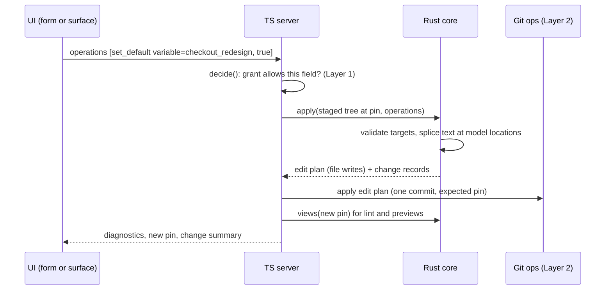

# Console semantic viewing and editing (Layer 3)

Status: draft for review. This layer sits between git ops
(`design/console-git-ops.md`), which moves files without understanding them,
and the domain surfaces of Layer 4, which will speak in feature flags and
pricing. Layer 3 is where rototo's own model lives in the console: variables,
catalogs, enums, evaluation contexts, and the machinery to view and change
them safely. Identity and permissions are Layer 1
(`design/console-identity-authz.md`).

## What this layer does

Two jobs. First, show a package the way rototo understands it: entities, not
files, with references, diagnostics, and previews of how things resolve.
Second, turn a user's intent ("set this default to true", "add a rule")
into file changes, without every editor growing its own TOML rewriter.

The second job is the one that needs real design, because of what the study
of the current console found: viewing is genuinely semantic (derived from the
core's model), but editing is not. Today the "friendly" form editor rewrites
TOML with string helpers in the browser, the server has a second minimal
line-parser for one operation, and the whole file is shipped back as text.
The frontend has quietly become a second package parser, and second parsers
drift. This spec replaces all of that with one edit engine.

## The shape in one picture



The engine turns operations into an edit plan; Layer 2 turns the edit plan
into a commit. Nothing between the form and the file invents its own idea of
the format.

## Reading: two views, both from the core

The core already exposes two read surfaces, and this layer uses both as-is:

- **The semantic model** (`PackageSemanticModel`): a flat projection of every
  entity with a source location on every field, even fields that failed to
  parse. This drives entity lists, detail views, and, crucially, the edit
  engine's splicing (the locations exist precisely so a writer can edit at
  the range the parse reported).
- **The inspect report** (`PackageInspectReport`): the runtime-aware view.
  Resolve pathways, dependencies and consumers, sample coverage, resolution
  traces. This drives previews and the richer inspect screens.

The console's inventory projection (what the sidebar and lists render) is
rebuilt from the semantic model as today, with two corrections: qualifiers
disappear (the core dissolved them; condition variables are just bool
variables), and enums appear (the format has first-class `enums/<id>.toml`
files that today's console does not know about).

References get one promotion. The core's public reference view is a one-way
edge list (variable to the things it uses). The internal index already
answers the useful questions: what declares this, who references this, what
is at this cursor position. Layer 3 needs "who references this" in both
directions, for the connected-entities view and for Layer 1's cross-package
closure, so those queries become part of the public semantic model surface
instead of staying crate-private.

## Editing: one engine

All structured editing goes through a single edit engine in the Rust core.
The engine's contract:

```text
apply(staged tree, [operation]) -> { edit plan, [change record] } | error
```

It takes the staged package at a pin plus an ordered list of operations,
validates each operation, computes the new text for every touched file by
splicing at the locations the semantic model reported, and returns the file
writes (Layer 2's edit plan) plus a structured record of what changed.
Comments and formatting outside the spliced ranges survive untouched.

Four rules govern it:

**The engine refuses nonsense; lint judges meaning.** Validation is
structural: the target exists, the value parses, the index is in range. A
type change that orphans rule values goes through, and lint flags it on the
post-edit stage, which every save runs anyway. The moment the engine starts
judging semantics it becomes a second linter, and we are back to drift.

**Operations are ownership-aware.** The same operation compiles to different
files depending on whether the package owns the entity or inherits it from a
base: editing an owned catalog entry rewrites the entry file; editing an
inherited one writes `<entry>.update.toml`; deleting an inherited one writes
`<entry>.deleted.toml`; enum member changes on an inherited enum become the
update-marker file. Rule edits on an inherited variable materialize the full
`[resolve]` block in the update file, because rule lists never merge in the
composition rules. Governance denials surface here as friendly errors
("your package cannot delete the free plan"), not as load failures later.

**Targets use the addressing grammar.** Operations point at things with the
same grammar custom-lint targets use (`design/addressing.md`):
`variable=checkout_redesign`, `catalog=plans:entry=pro`, and pointers for
fields, `catalog=plans:entry=pro#/limits/api_calls`. One way to point at
things, everywhere: lint targets, grant scopes, edit operations, change
records.

**Change records carry intent.** Each record is the operation name, the
canonical address of what changed, and the before and after values. These
feed three consumers that otherwise need diff archaeology: Layer 1's
field-level grant checks (the operation is the semantic diff, no inference
needed), Layer 2's PR summaries (item, before, after), and the change-set
diary ("set default true to false", not "modified a file").

### Permissions and pointers

Grant checks quantize a pointer to its top-level field: an edit at
`#/limits/api_calls` is checked against a grant on `limits`. This matches
governance exactly, whose `allowed_fields` is top-level by design. If
sub-field permissions are ever needed, that is a governance format change
first, and grants inherit it automatically because they share the shape.

### The operation vocabulary

Creation and deletion, any kind:

| Operation | Notes |
| --- | --- |
| `create_variable {id, type, description?, default}` | skeleton file; replaces today's templates |
| `create_catalog {id, schema}` | schema file under `model/catalogs/` |
| `create_entry {catalog, key, fields}` | |
| `create_enum {id, type, members, description?}` | |
| `create_context {id, schema}` | plus a default sample |
| `create_layer {id, unit, buckets}` | hash unit and bucket count are fixed at creation |
| `create_sample {context, key, content}` | |
| `delete {target}` | owned: remove the file; inherited: `.deleted.toml` where the format has the shape, a clear refusal where it does not |

Variables:

| Operation | Notes |
| --- | --- |
| `set_description {variable, text?}` | absent text clears it |
| `set_type {variable, type}` | applies structurally; lint judges the fallout |
| `set_default {variable, value}` | generalizes today's one server-side edit to all types |
| `add_rule {variable, position?, when, value}` | or `query` for catalog-typed; default position is the end |
| `update_rule {variable, index, when?, value?, query?}` | partial update of one rule |
| `remove_rule {variable, index}` | |
| `move_rule {variable, from, to}` | today's drag-reorder |

Rules are addressed by index on purpose: rules are positional in the format
(first match wins), and the expected-pin staleness check from Layer 2
handles the concurrent-save race. Stable rule handles would be format creep.
A note for Layer 4: gradual rollouts do not live in rules. They live in
layers and allocations, and the rollout dial compiles to `set_arm_buckets`
below.

Catalog entries:

| Operation | Notes |
| --- | --- |
| `set_field {target with pointer, value}` | e.g. `catalog=plans:entry=pro#/monthly_price`; nested pointers welcome, grants quantize to the top-level field |
| `unset_field {target with pointer}` | removes an optional field |

Enums:

| Operation | Notes |
| --- | --- |
| `add_member {enum, value}` and `remove_member {enum, value}` | inherited enums compile to the update marker |
| `set_description {enum, text?}` | |

Layers and allocations (rollouts and experiments are first-class, not
source-only):

| Operation | Notes |
| --- | --- |
| `add_allocation {layer, id, status?, eligibility?, arms}` | arms and their bucket ranges are defined together |
| `remove_allocation {layer, id}` | ending an experiment or rollout |
| `set_allocation_status {layer, id, status}` | |
| `set_allocation_eligibility {layer, id, when?}` | absent clears it |
| `set_arm_buckets {layer, allocation, arm, buckets}` | the rollout dial: growing 20% to 50% is this one operation |

The vocabulary deliberately has no operation for changing a layer's hash
unit or bucket count. Doing that under live allocations silently reassigns
every user, so it is a structural act: done in source, flagged by lint, and
usually better expressed as a new layer.

Samples:

| Operation | Notes |
| --- | --- |
| `replace_sample {context, key, content}` | whole-document replace; samples are small JSON and field-level operations are not worth their complexity |

### Deliberately source-only in v1

Catalog schemas, evaluation-context schemas (JSON Schema authoring is its
own craft; a form over it would be worse than the editor), Lua linters,
`governance.toml`, and the package manifest. These
are edited as raw text only. Any of them can graduate to operations later
without touching the vocabulary above.

### The raw-text path

The workbench's source editor stays, for every file, as the escape hatch. A
raw-text save bypasses the engine: it ships the whole file, lint validates
after, and Layer 1's field-level grant checks fall back to parse-and-diff
(stage the before and after, compare their semantic models, check the
changed fields against the grant). One engine does not mean one path; it
means one implementation for every path that claims to be structured.

### Where the engine runs

On the server, in the Rust core, behind bindings. The form UI submits
operations and receives new text and diagnostics; server round-trips per
field change (debounced) are acceptable. If they ever are not, the engine
compiles to WASM and the same Rust code runs in the browser: one engine, two
hosts, still zero drift. Server-side stays the source of truth either way.

## Previews: rebuilt on traces

The current preview machinery is qualifier-era code (truth tables of named
qualifiers, a helper that only understands `env.qualifier[...]` rule shapes)
and the frontend renders almost none of what the server computes. It is not
renamed; it is replaced.

The replacement leans on what the runtime now provides: real resolution with
`VariableResolutionTrace`. For a variable and a set of sample contexts (the
package's own `model/context/<id>-samples/`), the preview shows, per
context: the resolved value, its provenance (which package's resolve block
decided, for composed packages), and the rule walk, every rule considered
in order with its verdict, ending at the first match or the default. That
is the full explanation of "what would callers get and why", and it is the
same data `rototo resolve` prints, so the console and CLI cannot disagree.

Two placements, same machinery: on inspect screens (how does this variable
behave today) and live in the editor (how would it behave with my unsaved
edit, computed against the edited text through the same staged-overlay
mechanism the LSP uses). Condition variables need no special preview
treatment: they are bool variables and preview like any other.

## Viewing: what a user sees per entity

Every entity gets: rendered detail from the semantic model, the source text
with diagnostics inline, its connected entities (from the promoted reference
queries), and entity-scoped previews where resolution applies. The friendly
form appears for the kinds with operations (variables, catalog entries,
enums, samples, layers); everything else is source-first. The catalog-entry form
keeps today's genuinely good schema-driven widgets (sliders, selects, tags,
color and date inputs, driven by the catalog's JSON Schema, with enum
references resolved to member lists); the widgets stay, only their save path
changes from string rewriting to `set_field` operations.

## LSP

The bridge survives as-is architecturally: the real language server runs
in-process per editing session, unsaved editor text rides as overlays,
diagnostics, completion, and hover are forwarded. Two additions: forward
definition and references (the server already implements both; the bridge
just never exposed them), and drop the qualifier-era wire fields. The LSP
serves the raw-text path; the form path gets its diagnostics from staging
lint after applying operations.

## What this layer needs from the core (bindings inventory)

Following the convention from Layer 1 section 12. Beyond Layer 2's staging
and views:

- the semantic model with locations, plus the promoted reference queries
  (declaration of, references to, both directions);
- the inspect report;
- the edit engine: `apply(tree, operations)`;
- resolution with traces for previews (`resolve` with trace capture against
  a staged tree and a JSON context);
- the LSP bridge session (exists; extended as above).

Identity, grants, change sets, and git stay in TypeScript; nothing in this
layer touches a credential.

## What this retires

- The browser-side TOML string-rewrite helpers in the friendly editor, all
  of them. The form becomes a producer of operations.
- `variable_toml.rs`, the server's minimal second parser.
- The entity-creation templates in `package_edit.rs` (become `create_*`
  operations in the engine).
- The qualifier inventory items, qualifier preview machinery
  (`resolve_preview.rs` wholesale), qualifier sections, forms, truth
  tables, and wire types across server and frontend.
- The dormant preview wire types the frontend fetches and never renders;
  their replacements are the trace-based previews, actually rendered.
- The whole-file `{filePath, content}` save as the *primary* write path; it
  survives only as the raw-text escape hatch.

## Build order

1. **Engine core**: the operation vocabulary over owned entities, splicing,
   change records, structural validation. CLI templates (`rototo init`) move
   onto `create_*` operations here too, so the engine has two consumers from
   day one and single-consumer bias cannot creep in.
2. **Console adoption**: forms submit operations; previews rebuilt on
   traces; qualifier retirement lands here (it touches every screen anyway).
3. **Ownership-aware compilation**: overlay shapes (update and deleted
   markers), governance-denial messages. This slots in when composed
   packages become an editing target, and nothing in steps 1 and 2 needs
   rework for it because ownership was in the operation contract from the
   start.

## Things that would make us rethink

- **Sub-field permissions** (pointer-deep grants): reopen governance first;
  grants and the quantization rule follow it.
- **Stable rule handles**: only if index-plus-expected-pin demonstrably
  fails collaborating editors in practice.
- **WASM engine in the browser**: only if debounced server round-trips
  prove too slow for form editing.
- **Schema form editing**: if JSON Schema authoring through forms becomes a
  real need, it gets its own operations; nothing here blocks that.
