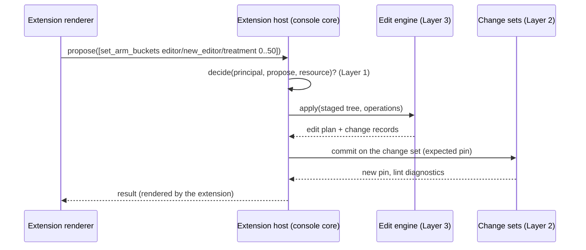

# Console surfaces and extensions (Layer 4)

Status: draft for review. This layer builds on semantic viewing and editing
(`design/console-semantic.md`), git ops (`design/console-git-ops.md`), and
identity and authorization (`design/console-identity-authz.md`). It is the
last mile: Layer 3 shows the package as what it *is* (variables, catalogs,
rules); this layer shows it as what it is *for* (feature flags, pricing,
providers), to people who should never need rototo's vocabulary.

## The stance

Three things could be meant by "domain UI", and this spec commits to a
stance on each:

- **Mapping**: a curated, relabeled, safety-scoped view over package
  entities. This is core console functionality, and it is the floor every
  surface gets.
- **Experiences**: a real feature-flags screen with rollout status, a plan
  matrix, a campaign calendar. These are product work, and they are
  deliberately **not core**. They are extensions, and the ones rototo ships
  (flags, table) are examples living in the repository, holding zero
  architectural privilege. If the extension contract cannot support them,
  the contract is wrong, and we find out on our own code.
- **Bespoke applications**: a company's own pricing tool with margin
  calculators and custom workflow. Out of scope permanently. That is an
  application built on the console API and SDK. Naming this boundary keeps
  the extension point from growing into a UI framework.

And one commitment that shapes everything below: **the console configures
itself with rototo.** A surface is not a new package concept. It is a
catalog entry, in a catalog whose schema the console defines, exactly the
way any application defines the shape of its own runtime configuration.
Rototo's core gains no new entity kind, no new directory, no new lint
namespace, and no new CLI selector from this layer. Everything a surface
needs (review, composition, governance, tenancy) already works, because
catalogs already work.

## Surface configuration

### The catalog

The console owns a catalog schema, `console_surfaces.schema.json`, shipped
with the console and vendored into a package under `model/catalogs/` like
any catalog schema. The catalog id is `console/surfaces` (namespaced ids
are ordinary rototo). Each entry is one surface:

```toml
# data/catalogs/console/surfaces/pricing.toml
kind = "table"
title = "Pricing"
description = "Plans and prices. Money changes take force on their effective date."
audience = ["internal"]
approval = "role:pricing_admins"

[[bind]]
target = "catalog=plans"
editable_fields = ["monthly_price_usd", "limits"]

[[bind]]
target = "catalog=prices"
can_add = true
editable_fields = ["amount", "effective_from"]

[[bind]]
target = "variable=active_plan"
```

Field by field:

- `kind` names the experience that renders this surface. Unknown kinds fall
  back to the floor (below), so a kind is a request, not a dependency.
- `audience` is `internal`, `tenant`, or both. Tenant sessions see only
  tenant-audience surfaces. Default `internal`.
- `approval` names the requirement a change set touching this surface must
  satisfy: `role:<id>` (a console role, Layer 1), or `none` for auto-merge
  surfaces (kill switches, provider failover, where speed is the point).
  Absent means the deployment default (any principal with the approve
  grant, two-person rule per Layer 1 policy). A change set touching several
  surfaces must satisfy every touched surface's requirement.
- `caution` (optional, not shown above) is a plain-language warning the
  renderer must show near edits ("this knob hits 100% of traffic on the
  next refresh").
- Each `bind` names entities with the addressing grammar
  (`design/addressing.md`), joining lint targets, edit operations, grant
  scopes, and change records as its consumers. `editable_fields`, `can_add`, and
  `can_delete` bound the affordances; they can be narrower than grants and
  governance but never effectively wider, because enforcement lives below
  (Layer 1 checks grants, load-time governance checks packages, and the
  surface config cannot mint operations).
- Per-kind configuration rides in an optional `[config]` table the schema
  leaves open and the extension's own schema fragment validates.

### Where it lives

Default and convention: in the config package itself, one review stream,
surfaces versioning with the entities they bind (a rename PR updates both,
and validation catches what it misses). Also permitted, with no special
machinery because it is just packages: a companion package that `extends`
the config package and carries only the console catalog, for teams that
want zero console data in the app package.

### Composition, tenants, governance

All existing mechanics, none new:

- Catalog entries compose additively. A base declares tenant-audience
  surfaces once; every tenant overlay inherits them. A tenant's edits made
  through those surfaces land as overlay files (Layer 3's ownership-aware
  compilation), bounded by the base's governance.
- Whether an overlay may add, update, or delete surface entries themselves
  is governed by `[catalog.console/surfaces]` in the base's
  `governance.toml`, deny by default like everything else. The steering
  wheel is itself steerable only where the base allows.

### Validation

Two layers, honest about what each catches:

- **The console validates on load**, always: bindings that resolve to
  nothing, kinds nobody renders, approval roles that do not exist,
  editable fields absent from the bound schema. Rendered as console
  diagnostics on the surface list and the admin screens.
- **A vendorable lint script**, shipped with the console under the
  `console/` authority (the existing Lua custom-lint mechanism, dogfooded):
  packages that include it get dangling-binding failures in CI, not just in
  the console. Optional by design; the console works without it.

### Schema evolution

The vendored schema will age inside packages. The rule is additive-only
evolution plus a console freshness diagnostic ("this package's surfaces
schema is older than this console expects"), the same pattern the generated
package READMEs use. Breaking schema changes are a migration event and
should be as rare as package-format changes.

## The floor: every surface renders, always

The console core ships the null renderer. It walks a surface's bindings and
renders each entity with a control inferred from its type, no extension
required:

| Bound entity | Floor control | Operations it may emit |
| --- | --- | --- |
| bool variable | toggle | `set_default`, rule-value flip |
| enum-typed variable | select (members as options) | `set_default` |
| int / number variable | number input | `set_default` |
| string variable | text input | `set_default` |
| catalog (or entries) | table, schema-driven cell widgets | `set_field`, `unset_field`, `create_entry` / `delete` where `can_add` / `can_delete` |
| layer | allocation list with a range dial | `set_arm_buckets`, `set_allocation_status` |

The confirmed principle: **a control exposes exactly its operations and
nothing else.** A toggle on a variable cannot change its type or
description; the control is the affordance boundary, grants and governance
are the enforcement. Fields with `x-rototo-ref` render as reference pickers
(entry ids or enum members as options), reusing the schema-driven widget
work the current console already does well.

The floor is also the CLI parity line: `rototo show --catalog
console/surfaces` reads surface config as ordinary data, and surface
content renders in the CLI at floor fidelity (items, effective values,
previews). Experiences are console-side; the mapping is the portable
guarantee.

## The read side

Surfaces are looked at far more than they are edited. Every surface, floor
or extension, gets four read affordances:

- **Effective values with previews**: per bound item, the current composed
  value, plus trace previews against the package's sample contexts (Layer
  3's traced resolution, including query winners: "which banner wins for
  this visitor", "which provider for sms in the EU").
- **Upcoming changes**: entries whose `effective_from` is in the future and
  rules whose conditions test `env.now` against instants yet to pass,
  derived from the semantic model by the core (`upcoming_changes` in the
  bindings inventory below). The pricing surface shows the October increase
  before October; the flags surface shows Friday's scheduled flip.
- **Surface history**: the git history of the surface's bound entities'
  files (Layer 2's compare and log machinery, filtered by the binding
  paths). This is the compliance answer to "what was the retention policy
  on March 3rd", scoped to the surface the auditor is looking at.
- **Pending change sets**: open change sets touching bound entities, with
  their approval state (Layer 2 data, filtered the same way).

## Extensions

### What an extension is

A deployment-installed package of TypeScript that registers renderers for
surface kinds. Distribution is build-time composition (the deployment's
console build lists its extensions as dependencies); dynamic plugin loading
is deferred until someone needs it. One contribution point exists in v1:
the surface renderer. No entity tabs, no dashboard cards, no menu items
until something real demands them.

### The contract

An extension's renderer receives exactly two capabilities plus a toolkit:

```text
read:     the surface's bound entities as semantic views, effective values,
          trace previews, upcoming changes, history, pending change sets.
          Served through a typed client scoped to the signed-in principal;
          the server enforces grants, the client simply cannot see more
          than the user could.

propose:  submit Layer 3 operations against a change set. These flow
          through decide(), the edit engine, governance, lint, and approval
          exactly like every other edit in the system.

ui kit:   the console's design-system components, so extensions look like
          the console.
```



The load-bearing property: **extensions render and propose, nothing else.**
No file access, no git, no tokens. The entire enforcement stack sits below
the extension API by construction, so a buggy or malicious extension can
mislead the eye but cannot exceed the authority of the user in front of it.

### Trust

Extensions are deployment-trusted code, installed by the operator, running
in the user's session. No marketplace, no signing, no sandbox in v1; the
propose-only contract bounds the blast radius, and the operator's trust in
what they install covers rendering honesty. This is the Backstage and
Grafana posture, stated plainly.

### Degradation

Unknown kind, uninstalled extension, extension that throws: the surface
renders on the floor. A missing extension never breaks a deployment and
never hides configuration; it only makes it plainer. Extensions must also
degrade per item: when a bound entity's shape outgrows what the experience
understands (a flag variable with rules more clever than rings), that item
renders as "advanced shape, view in workbench" with an escalation link.
Experiences degrade; they never block and never lie.

### Extension configuration is rototo too

An extension needing deployment-independent configuration does what the
surface mechanism itself does: ship a catalog schema, read a catalog from
the package. One pattern, no special cases. Deployment-level settings (API
keys, theme) stay in console deployment config; anything reviewable about
package behavior belongs in the package.

## The two example extensions

Both live in the repository as reference implementations with zero
privilege, maintained like `examples/` packages: they prove the contract,
dogfood the API, and ship working out of the box.

**flags** (`kind = "flags"`). Renders bound bool variables and layers as a
flag list with derived status: "on for employees, 40% for everyone else,
scheduled to complete Friday". The status derivation interprets default
plus rules plus allocation into a domain state, and recognizes specific
shapes: simple default, ring rules keyed on context facts, one allocation,
`env.now` schedule rules. Affordances: toggle, ring advancement
(`update_rule` / `move_rule`), the rollout dial (`set_arm_buckets`),
schedule a flip (`add_rule` with an `env.now` condition), kill switch
(a toggle on a surface whose `approval = "none"`). Anything it does not
recognize degrades per item.

**table** (`kind = "table"`). Renders bound catalogs as rich tables:
schema-driven columns and cell widgets, reference pickers from
`x-rototo-ref`, effective-dating awareness (current versus scheduled rows
when entries carry date fields), priority ordering, and a query-winner
preview panel when a bound variable selects from the catalog. One archetype
configured three ways covers pricing (use case 4), providers and failover
(use case 8), and campaigns and banners (use case 6), and it is the natural
tenant-audience surface for use case 5.

Coverage against the use-case catalog: flags covers 1 and (view-first) 2;
the floor covers 3 (ops knobs are typed variables); table covers 4, 5, 6,
and 8; 7 (compliance) is floor plus history; 9 and 10 are affordances
(upcoming changes; the same surface rendered per environment package) not
surfaces.

## What this layer needs from the core

Following the bindings-inventory convention. Beyond Layer 3's inventory,
exactly one addition:

- `upcoming_changes(tree, package)`: entries with future effective dates
  and rules with unpassed `env.now` boundaries, derived from the semantic
  model and expression analysis.

Everything else this layer consumes (semantic views, traced resolution,
the edit engine, history and compare, change sets) exists in the lower
layers' inventories. Surface config itself needs nothing: it is catalog
data, read like any other.

## What this layer retires or forecloses

- The earlier scratch design's `surfaces/*.toml` as a first-class package
  concept, along with its `rototo/surface-*` lint ids and `--surface` CLI
  selectors. None of it is needed; catalogs already do all of it.
- Any notion of UI code or layout in packages. The test for whether a field
  belongs in surface config: would a CLI, an audit script, or lint care?
  If only a browser could care, it belongs in the extension.
- Workflow state machines. Workflows remain guided editing (a decided
  scope); the only lifecycle state in the system stays the change set.

## Build order

1. **Floor**: the surfaces catalog schema, load-time validation, the null
   renderer with inferred controls, audience filtering, approval
   consumption by change sets. Every surface works from this point on.
2. **Read side**: previews on surfaces, upcoming changes (with the new core
   binding), surface history, pending change sets.
3. **Extension host**: the contract, degradation, and the **table**
   extension (broadest use-case coverage, and it stress-tests schema-driven
   rendering).
4. **flags** extension (needs the status derivation and leans on Layer 3's
   allocation operations), plus the vendorable `console/` lint script.

## Things that would make us rethink

- **Dynamic plugin loading or a marketplace**: only if deployment-time
  composition proves too rigid for real operators. Signing and sandboxing
  become questions then, not before.
- **More contribution points**: a second one (entity detail tabs are the
  likely candidate) only when an extension cannot do its job without it.
- **Per-extension config crowding**: if `[config]` tables grow unwieldy,
  extensions can graduate to their own catalogs; the pattern already
  allows it.
- **Bespoke pressure**: if multiple teams build the same "custom" app on
  the SDK, that is evidence an archetype is missing, and it should become
  an example extension rather than a core feature.
